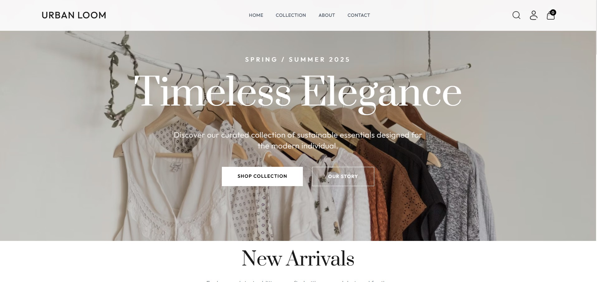
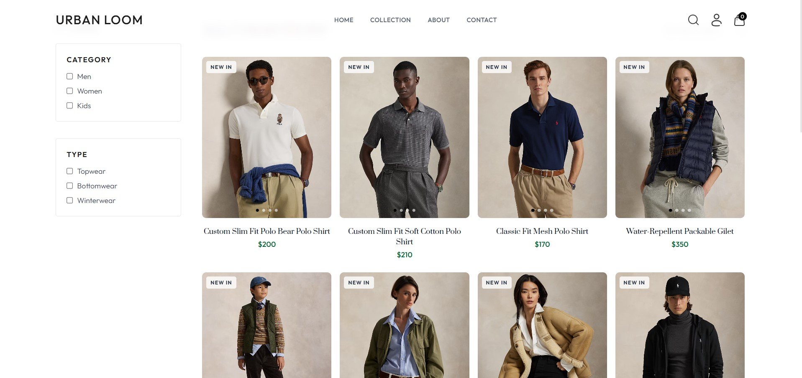
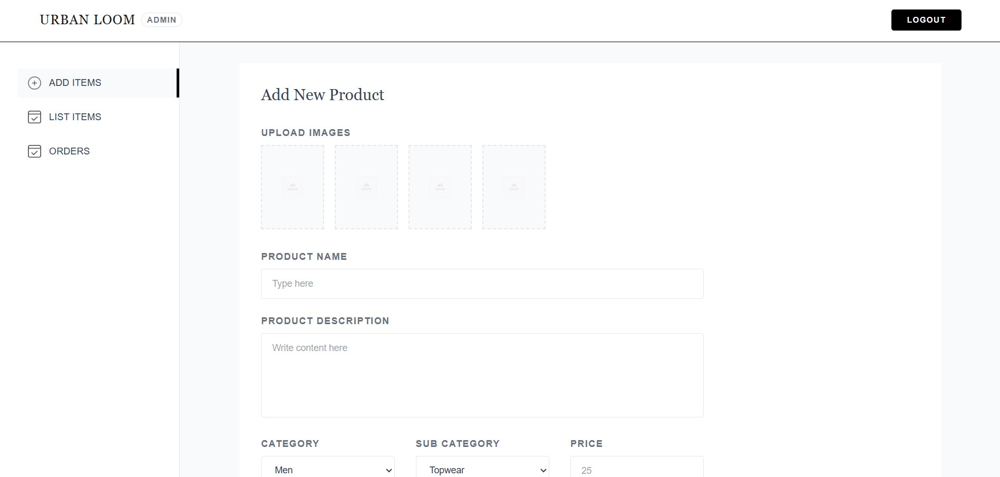
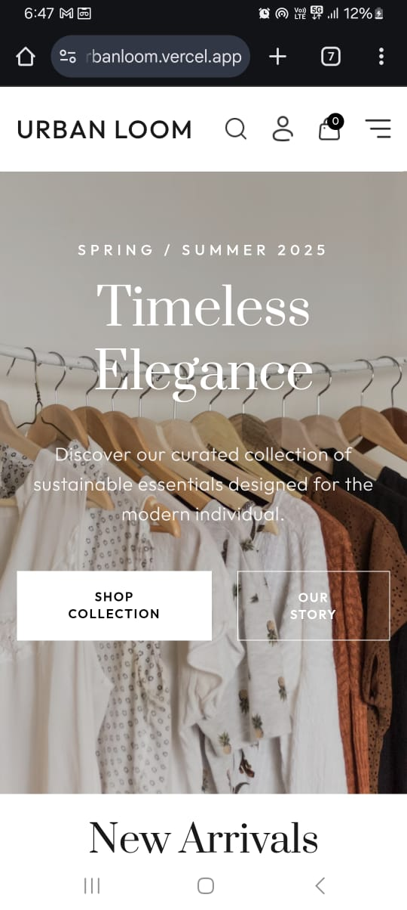
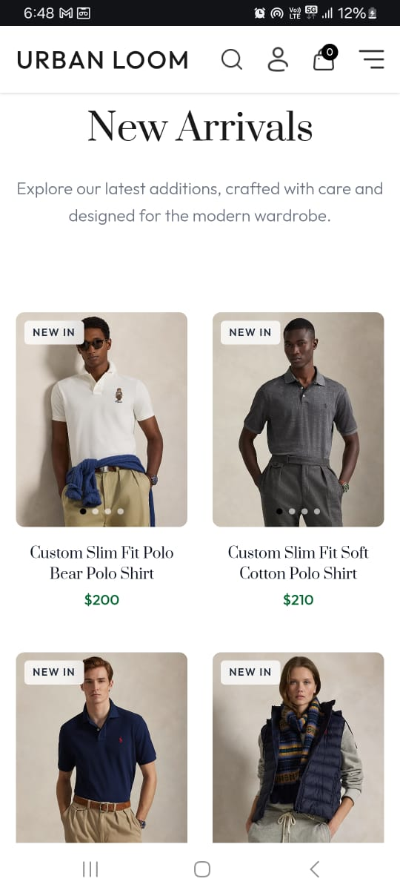

# Urban Loom - Premium E-Commerce Platform

**Live Website:** [https://urbanloom.vercel.app/](https://urbanloom.vercel.app/)

Urban Loom is a modern, full-stack e-commerce application designed with a premium, minimalist aesthetic. It features a responsive frontend for customers and a comprehensive admin panel for store management.

<!-- Attach Main Banner/Home Page Image Here -->


## 🚀 Features

### Frontend (Customer Experience)
*   **Premium UI/UX**: Minimalist design with smooth animations, glassmorphism effects, and a clean typography system (Prata & Outfit fonts).
*   **Responsive Design**: Fully optimized for desktop, tablet, and mobile devices.
*   **Product Browsing**:
    *   **Advanced Filtering**: Filter by category, sub-category, and price.
    *   **Search**: Real-time search functionality.
    *   **Product Details**: Image carousel, size selection, and related products.
*   **Shopping Cart**: Dynamic cart management with persistent state.
*   **Secure Checkout**: Integrated with Stripe and Razorpay for secure payments.
*   **User Accounts**: User registration, login, and order history tracking.
*   **Newsletter**: Subscription form for marketing updates.

<!-- Attach Collection Page or Product Page Image Here -->


### Admin Panel (Store Management)
*   **Dashboard**: Overview of store performance.
*   **Product Management**: Add, edit, and remove products with image uploads.
*   **Order Management**: Track and update order status (Order Placed, Shipped, Delivered).
*   **Secure Login**: Admin-only access protection.

<!-- Attach Admin Dashboard Image Here -->


## 🛠️ Tech Stack

### Frontend
*   **React 19**: Modern UI library for building interactive interfaces.
*   **Vite**: Next-generation frontend tooling for fast builds.
*   **Tailwind CSS v4**: Utility-first CSS framework for custom styling.
*   **React Router**: For seamless client-side navigation.
*   **Context API**: For global state management (Cart, Auth).

### Backend
*   **Node.js & Express**: Robust server-side runtime and framework.
*   **MongoDB & Mongoose**: NoSQL database for flexible data modeling.
*   **JWT**: JSON Web Tokens for secure user authentication.
*   **Multer**: For handling file uploads (product images).

### Tools & Services
*   **Cloudinary**: Cloud storage for product images.
*   **Stripe / Razorpay**: Payment gateway integration.

## 📦 Installation & Setup

1.  **Clone the repository**
    ```bash
    git clone https://github.com/yourusername/urban-loom.git
    cd urban-loom
    ```

2.  **Install Dependencies**
    *   **Frontend**:
        ```bash
        cd frontend
        npm install
        ```
    *   **Backend**:
        ```bash
        cd backend
        npm install
        ```
    *   **Admin**:
        ```bash
        cd admin
        npm install
        ```

3.  **Environment Variables**
    Create a `.env` file in the `backend` directory:
    ```env
    MONGODB_URI=your_mongodb_connection_string
    CLOUDINARY_NAME=your_cloud_name
    CLOUDINARY_API_KEY=your_key
    CLOUDINARY_SECRET_KEY=your_secret
    JWT_SECRET=your_jwt_secret
    STRIPE_SECRET_KEY=your_stripe_key
    RAZORPAY_KEY_ID=your_razorpay_key_id
    RAZORPAY_KEY_SECRET=your_razorpay_key_secret
    ADMIN_EMAIL=admin@example.com
    ADMIN_PASSWORD=admin123
    PORT=4000
    ```

    Create a `.env` file in the `frontend` directory:
    ```env
    VITE_BACKEND_URL=http://localhost:4000
    VITE_RAZORPAY_KEY_ID=your_razorpay_key_id
    ```

    Create a `.env` file in the `admin` directory:
    ```env
    VITE_BACKEND_URL=http://localhost:4000
    ```

4.  **Run the Application**
    *   **Backend**: `npm run server` (in `backend` folder)
    *   **Frontend**: `npm run dev` (in `frontend` folder)
    *   **Admin**: `npm run dev` (in `admin` folder)

## 📱 Mobile Experience
The application is designed with a mobile-first approach, ensuring a seamless shopping experience on smartphones.

<div style="display: flex; gap: 10px;">
  
  
</div>
